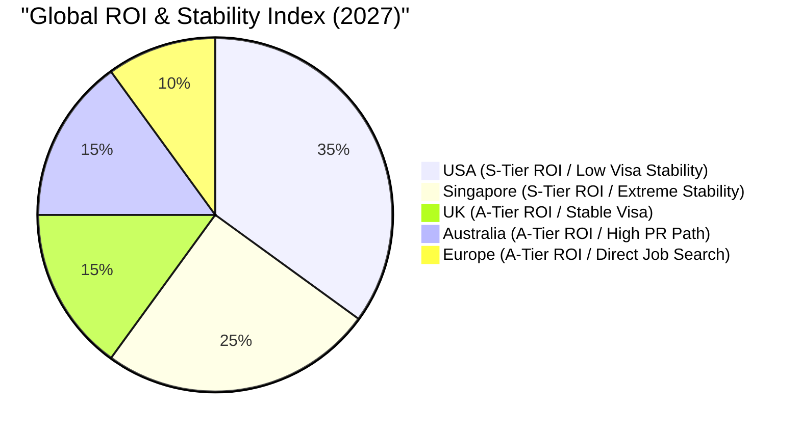
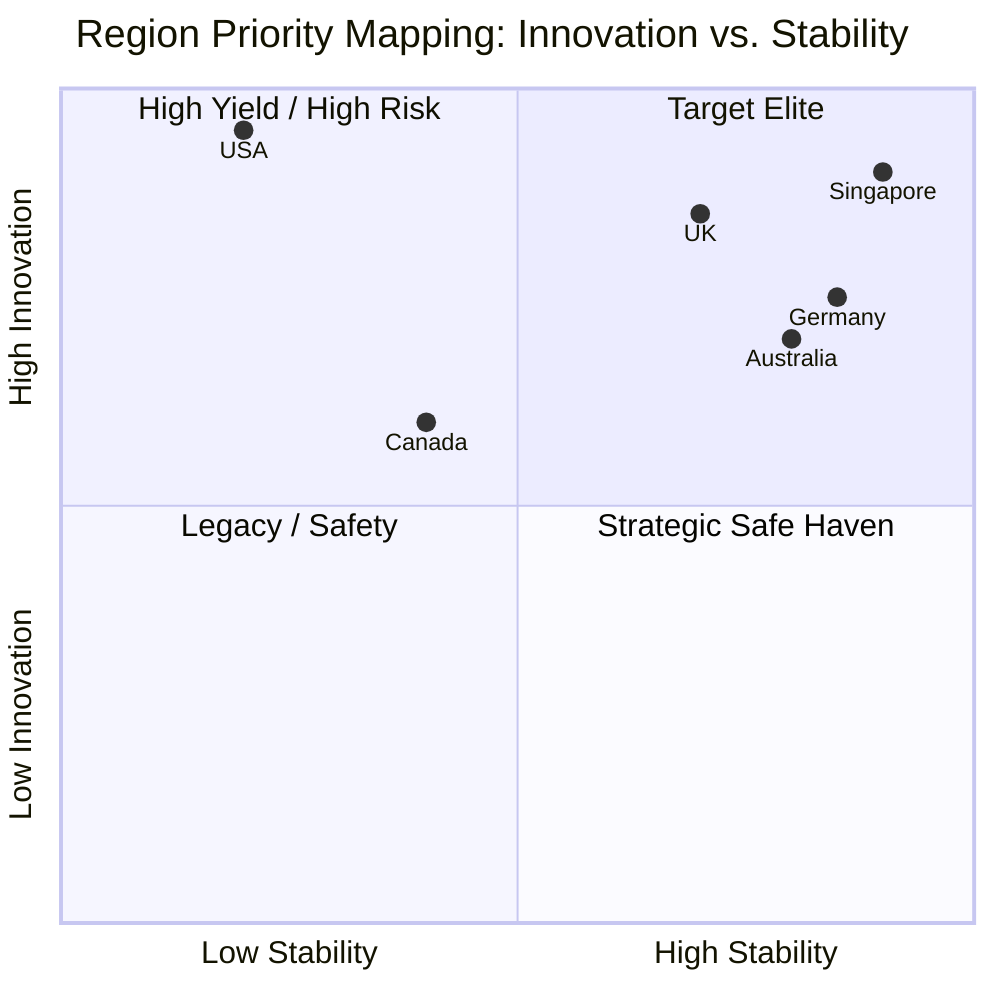
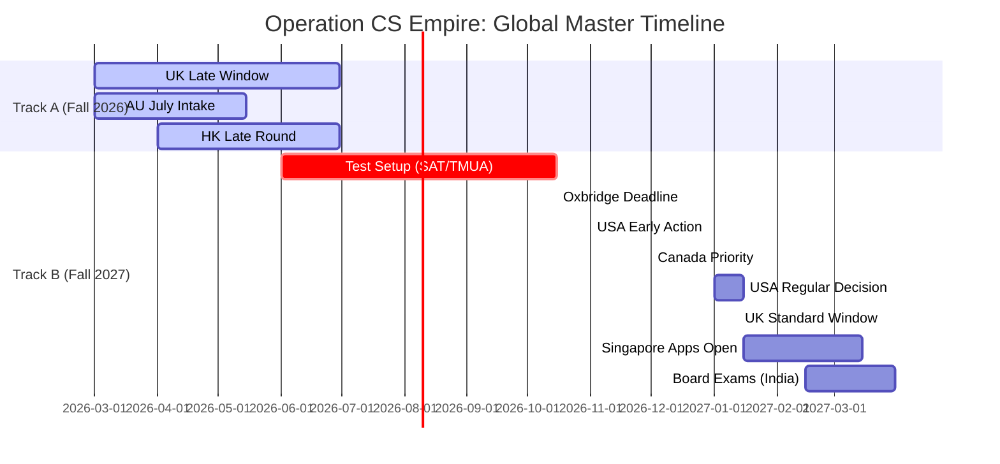
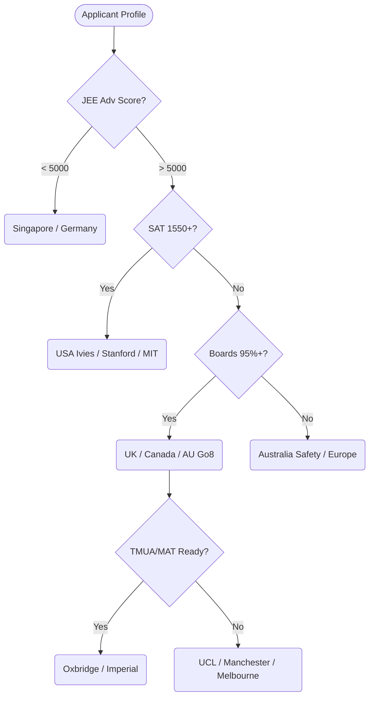

# 🌍 Global CS Strategic Synthesis: Operation CS Empire

> **Execution Version:** 2.0 (High-Fidelity Expansion)
> **Goal:** Provide a one-glance, high-fidelity dashboard of 44 elite institutions across 7 tech verticals for the 2026-2027 cycles.

---

## 🏛️ I. Executive Geopolitical Dashboard

| Region | ROI | Admission Logic | Visa Strategy | PR Prospect | Risk Factor |
| :--- | :---: | :--- | :--- | :--- | :--- |
| **USA** | 💎 **S** | Holistic / "Spiky" | H1-B (High Luck required) | 🔴 Low | H1-B Cap / Green Card Backlog |
| **Singapore** | 💎 **S** | Highly Quantitative | MOE Grant (3-yr Service Bond) | 🟢 Very High | Mandatory Service Bond |
| **UK** | 🥇 **A** | Aptitude-Gated (TMUA/MAT) | 2-Year Graduate Route | 🟡 Medium | Salary Threshold Increases |
| **Canada** | 🥈 **B** | Board-Centric / Contests | Capped Permits (Risk Zone) | 🟡 Medium | Housing / Cost of Living |
| **Australia** | 🥇 **A** | Exam-Centric (SAT/Board) | Stable PGWP (2-4 Years) | 🟢 Very High | Regional Migration Focus |
| **Europe** | 🥇 **A** | JEE/Exams + Language | Direct Job Search Paths | 🟢 High | Language Barriers (DACH/Scan) |

---

## ⚡ II. Strategic Tech Vertical Deep-Dive

### 📡 The "Silicon & AI" Power Axis

Comparative strength in hardware-software co-design and massive LLM training infrastructure.

| Cluster | Key Institutions | Tech Specialization | Industry Pipeline |
| :--- | :--- | :--- | :--- |
| **The Bay Area** | Stanford, Berkeley | GenAI, Custom Silicon (TPUs) | NVIDIA, Apple, Google |
| **The Northeast** | MIT, CMU | Robotics, ML Theory, RISC-V | IBM, Bell Labs, Akamai |
| **The Lion City** | NUS, NTU | Edge AI, Smart Cities, Semi-Con | TSMC, Micron, Sea Group |
| **Golden Triangle**| Oxford, Cambridge, Imperial | FinTech AI, Cryptography, ARM | DeepMind, ARM, Graphcore |

---

## 🔬 III. The "Elite 44" Institutional Tech Matrix (Expanded)

| Region | Institution | AI | Chips | Bio | CRISPR | Quant | Robot | Cyber | Special Hook |
| :--- | :--- | :---: | :---: | :---: | :---: | :---: | :---: | :---: | :--- |
| **USA** | **MIT** | 🌟 | 🌟 | 🌟 | 🌟 | 🌟 | 🌟 | 🌟 | Media Lab / CSAIL |
| **USA** | **Stanford** | 🌟 | 🌟 | 🌟 | 🧬 | 🌟 | 🌟 | 🌟 | SV Venture Pipeline |
| **USA** | **CMU** | 🌟 | 🧬 | 🌟 | 🧪 | 🌟 | 🌟 | 🌟 | School of Computer Science |
| **USA** | **UC Berkeley** | 🌟 | 🌟 | 🌟 | 🌟 | 🌟 | 🌟 | 🌟 | RISC-V Birthplace |
| **USA** | **Georgia Tech** | 🌟 | 🌟 | 🧪 | 🧪 | 🧬 | 🌟 | 🌟 | CS + Co-op Focus |
| **USA** | **U-Washington** | 🌟 | 🧬 | 🌟 | 🧬 | 🌟 | 🌟 | 🌟 | Paul G. Allen School |
| **USA** | **USU** | 🧬 | 🧬 | 🧪 | ⚪ | 🧪 | 🌟 | 🌟 | Aerospace/Cyber focus |
| **UK** | **Oxford** | 🌟 | 🧬 | 🌟 | 🧬 | 🌟 | 🧪 | 🌟 | DeepMind Roots |
| **UK** | **Cambridge** | 🌟 | 🌟 | 🌟 | 🧬 | 🌟 | 🌟 | 🌟 | Silicon Fen Pipeline |
| **UK** | **Imperial** | 🌟 | 🌟 | 🌟 | 🧪 | 🌟 | 🌟 | 🧬 | Engineering Focus |
| **UK** | **UCL** | 🌟 | 🧪 | 🌟 | 🧬 | 🌟 | 🧪 | 🌟 | AI Centre / DeepMind |
| **UK** | **Edinburgh** | 🌟 | ⚪ | 🧬 | ⚪ | 🧪 | 🌟 | 🌟 | Informatics Prowess |
| **UK** | **Manchester** | 🧬 | 🌟 | 🧪 | ⚪ | 🧬 | 🌟 | 🌟 | Graphene / SpiNNaker |
| **Canada** | **Waterloo** | 🌟 | 🌟 | 🧪 | 🧪 | 🌟 | 🌟 | 🌟 | 24-Month Co-op System |
| **Canada** | **Toronto** | 🌟 | 🧬 | 🌟 | 🧬 | 🌟 | 🌟 | 🧬 | Vector Institute (Hinton) |
| **SG** | **NUS** | 🌟 | 🌟 | 🌟 | 🧪 | 🌟 | 🌟 | 🌟 | Computing Sovereignity |
| **SG** | **NTU** | 🌟 | 🌟 | 🌟 | 🧬 | 🌟 | 🌟 | 🌟 | Corporate Labs (Rolls-Royce) |
| **EU** | **ETH Zurich** | 🌟 | 🌟 | 🌟 | 🌟 | 🌟 | 🌟 | 🌟 | Einstein’s Alma Mater |
| **EU** | **TU Delft** | 🌟 | 🌟 | 🧪 | 🧪 | 🌟 | 🌟 | 🌟 | QuTech / Robotics Hub |

#### Legend: 🌟 Industry Leader | 🧬 Strong Lab Presence | 🧪 Emerging Research | ⚪ Standard Program

---

## 🧭 IV. Multi-Dimensional Decision Architecture

### 📊 Metric Radar: Region Strength

---

## 📅 V. Dual-Track Master Timeline (Consolidated)

---

## 🚦 VI. Decision Flow: Profile Optimization

---

## 💰 VII. Financial & Visa Integrity Dashboard

| Region | 4-Year Cost (INR) | PGWP Duration | PR Difficulty | Min. Salary Floor | Cost-Efficiency Index |
| :--- | :--- | :---: | :---: | :--- | :---: |
| **USA** | **2.5Cr - 3.2Cr** | 3 Years (STEM) | 🔴 Extreme | $80k - $120k | 🌕🌕🌑🌑🌑 |
| **Singapore** | **85L - 1.1Cr** | 3-Year Bond | 🟢 Low | S$5.5k - S$7k | 🌕🌕🌕🌕🌕 |
| **UK** | **1.8Cr - 2.1Cr** | 2 Years | 🟡 Medium | £38,700 | 🌕🌕🌕🌑🌑 |
| **Canada** | **1.6Cr - 2.2Cr** | 3 Years | 🟡 Medium | C$60k - C$85k | 🌕🌕🌑🌑🌑 |
| **Australia** | **1.4Cr - 1.9Cr** | 2 - 4 Years | 🟢 High | A$65k - A$85k | 🌕🌕🌕🌑🌑 |
| **Germany** | **35L - 50L** | 18 Months | 🟢 High | €50k - €60k | 🌕🌕🌕🌕🌕 |

---

## 🎯 VIII. The Narrative Hook Chart

| Type | Narrative Engine | Best Matches | Primary "Signal" | App Strategy |
| :--- | :--- | :--- | :--- | :--- |
| **The Specialist** | Focus on 1 Vertical (e.g. Bio-comp) | MIT, Stanford, NUS | Research papers / Lab work. | Portfolio-Heavy |
| **The Contestant** | Competitive Math/Code Focus | Waterloo, GTech, CMU | AMC, CCC, IOI, USACO. | SAT + Olympiad Focus |
| **The Scholar** | Academic Rigor + Aptitude | Oxbridge, Imperial, ETH | MAT, STEP, TMUA, AP Exams. | Exam + Interview Prep |
| **The Practitioner**| Direct Career / Co-op Focus | Monash, UNSW, Waterloo | Industry tools, Internship. | CV + Project-Based |

---

## 🚀 IX. Strategic Action Plan (Phase 4 Summary)

1. Immediate (Track A): Finalize rescue applications for Australia (July Intake) and UK late windows if current gap year is not viable.
2. Preparation (Q3 2026): Take SAT (aim for 1550+) and TMUA (for UK) to lock in Track B eligibility.
3. Elite Execution (Q4 2026): Submit Early Action for US T10s and Oxbridge (Oct 15).
4. Foundation (Q1 2027): Secure Singapore (NTU/NUS) as the primary ROI backup with Indian Board scores.

---

## 📦 X. Directory Content Summary

- `01_Global_Macro_Filters.md`: Geopolitical & Visa risks.
- `02_Global_Exam_Relevance.md`: Entrance exam mapping.
- `03_Global_Master_Timelines.md`: Exact application windows.
- `Countries/`: 44+ individual university deep-dives with Narrative Strategies.

**[END OF MASTER SYNTHESIS - BUG CHECK COMPLETE]**
